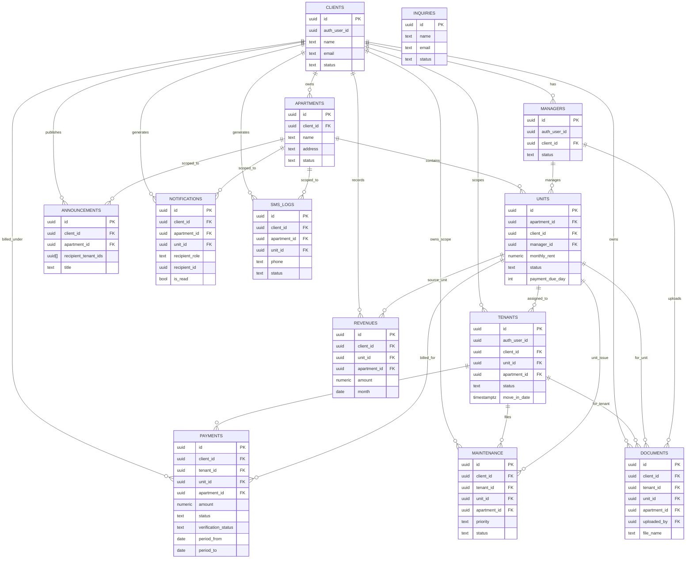

# PrimeLiving Database ERD and Explanation

This document explains the current PrimeLiving database design in ERD format for panel presentation and research paper use.

## 1) ERD (Current Canonical Model)

## 2) Presentation Explanation (Panel-Friendly)

PrimeLiving is a role-based rental operations system. The database is organized around three layers:

1. **Ownership layer** (`clients`, `managers`)
2. **Property inventory layer** (`apartments`, `units`)
3. **Operational transaction layer** (`tenants`, `payments`, `maintenance`, `documents`, `revenues`, `announcements`, `notifications`, `sms_logs`)

The key structural rule is:

- **`apartments` represent the property/building level**
- **`units` represent rentable spaces inside a property**

This removes ambiguity and gives clear reporting boundaries.

## 3) Cardinality and Relationship Logic

- One `client` (owner) can own many `apartments`.
- One `apartment` can contain many `units`.
- One `unit` can be managed by one `manager` at a time.
- One `unit` can have tenant assignments over time (`tenants` lifecycle).
- Payments, maintenance, documents, and revenues are linked to `unit_id` for precise operational tracking.
- Announcements, notifications, and SMS logs can be scoped at property level using `apartment_id`.

## 4) Why this ERD is good for the system

### a) Clarity

Separating building-level and unit-level entities avoids duplicate/inconsistent address and rent context.

### b) Scalability

A single owner can manage multiple properties and many units without changing core schema design.

### c) Auditability

Operational tables preserve context (`client_id`, `unit_id`, optional `apartment_id`) which improves reporting and traceability.

### d) Role-based operations

The data model cleanly supports admin, owner, manager, and tenant workflows.

## 5) Notes for Research Paper

You can describe this ERD as a **normalized transactional property management model** with:

- ownership hierarchy,
- inventory hierarchy,
- and role-driven operational transactions.

You can also mention that some legacy compatibility columns (for migration continuity) may still exist in selected tables, but **canonical runtime references use `unit_id` for operations and `apartment_id` for property-level communication scope**.

## 6) Suggested Defense Script (Short)

"Our ERD is designed around ownership, inventory, and transaction layers. We separate properties (`apartments`) from rentable spaces (`units`) so each operational record points to the correct level of granularity. Tenant, payment, maintenance, and revenue records are unit-scoped for precision, while announcements and notification channels can be property-scoped. This design improves consistency, report accuracy, and maintainability for multi-role property operations."