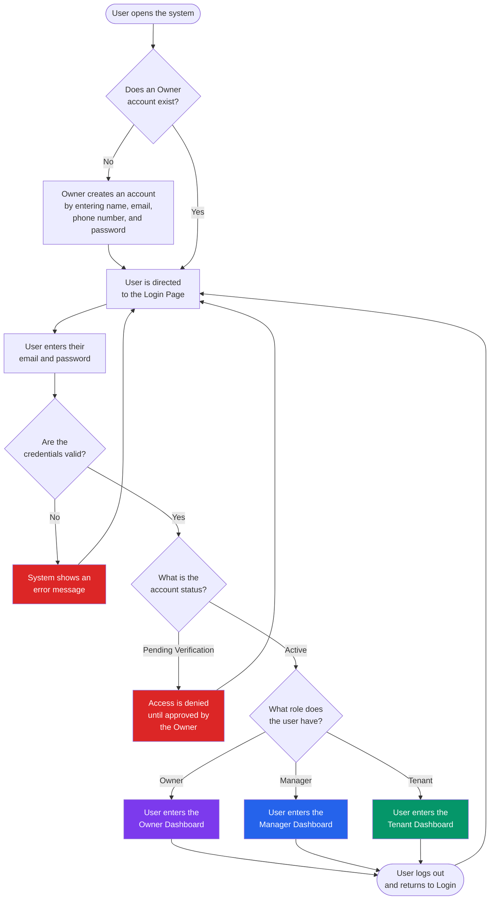
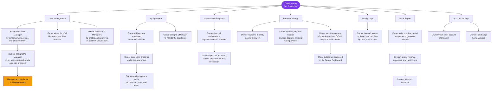
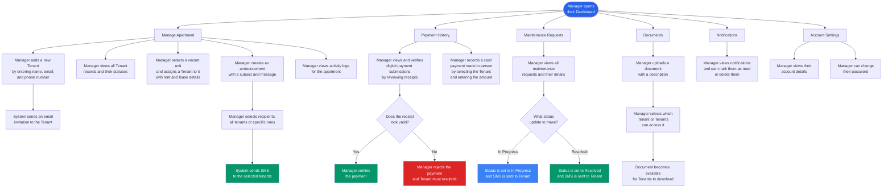
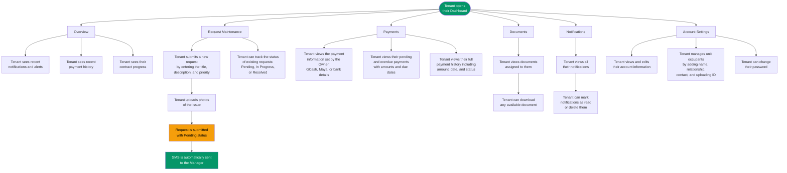
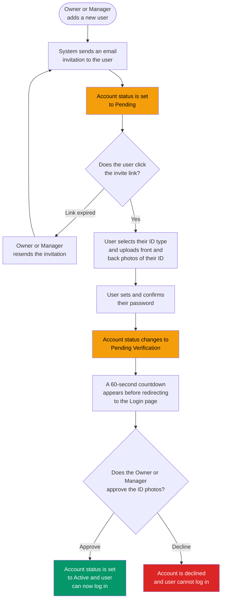
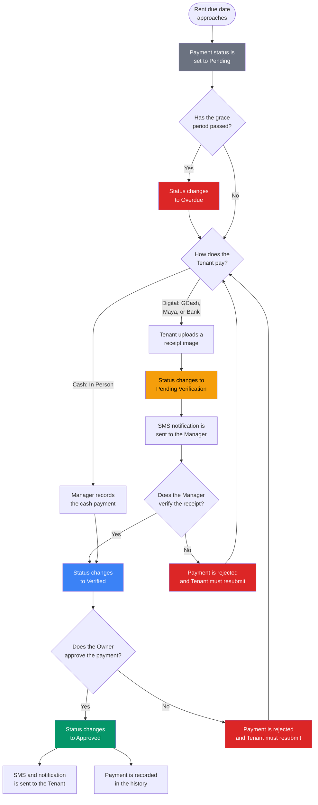
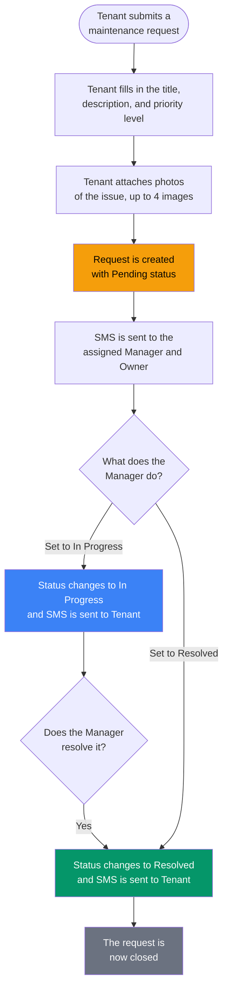
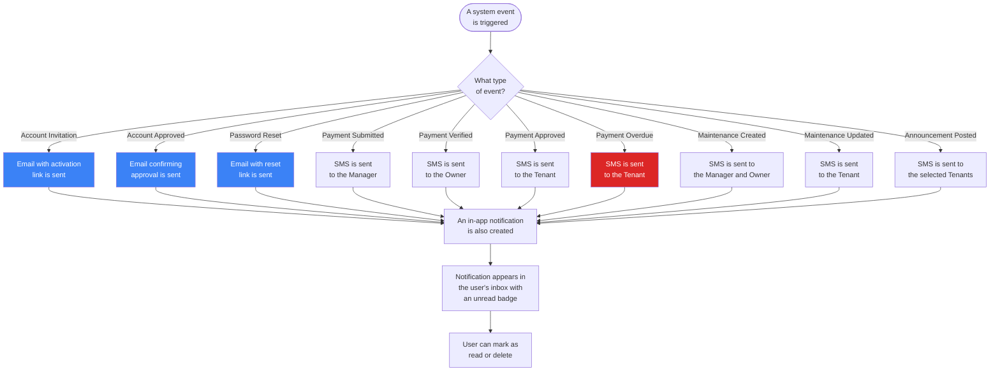

# E-AMS System Process Flow

> Electronic Apartment Management System with SMS-Based Notification and Automated Audit Reporting

---

## 1. Main System Flow

---

## 2. Owner Dashboard Process Flow

---

## 3. Manager Dashboard Process Flow

---

## 4. Tenant Dashboard Process Flow

---

## 5. User Onboarding Flow (Manager / Tenant)

---

## 6. Payment Lifecycle Flow

---

## 7. Maintenance Request Lifecycle Flow

---

## 8. Notification & SMS Flow

