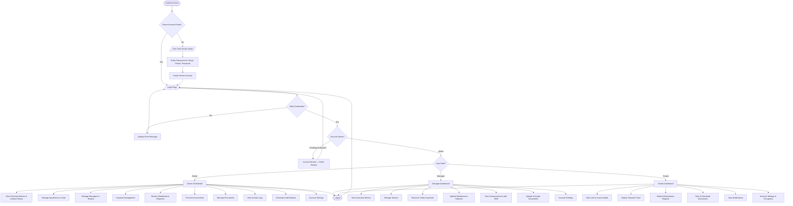
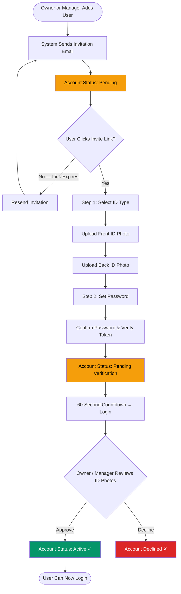
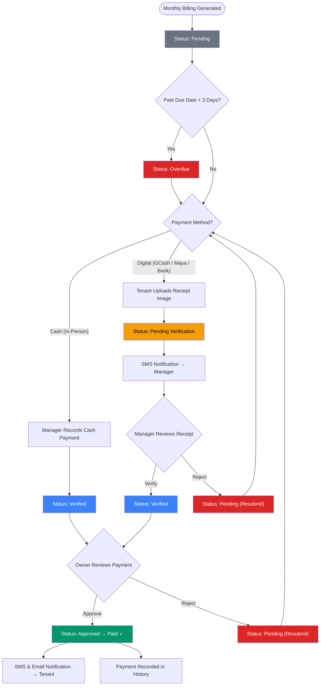
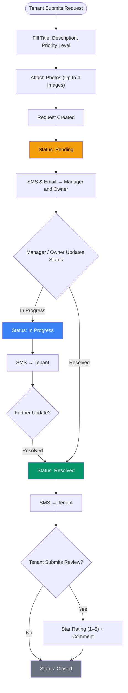
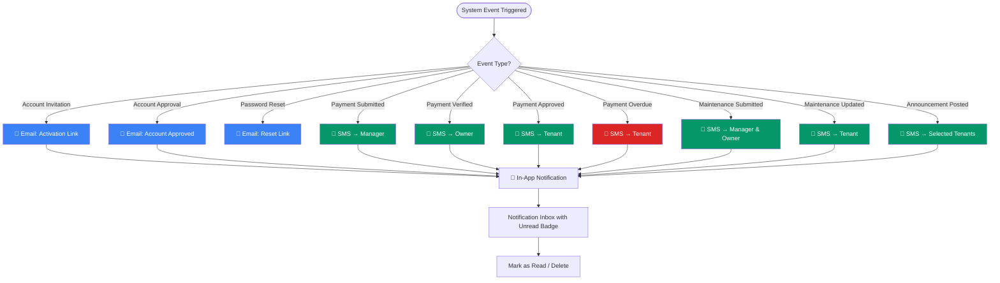

# E-AMS System Flowchart

> Enhanced Apartment Management System with SMS-Based Notification and Automated Audit Reporting

---

## Main System Flow

---

## User Onboarding Flow (Manager / Tenant)

---

## Payment Lifecycle Flow (Two-Step Verification)

---

## Maintenance Request Lifecycle Flow

---

## Notification System Flow

