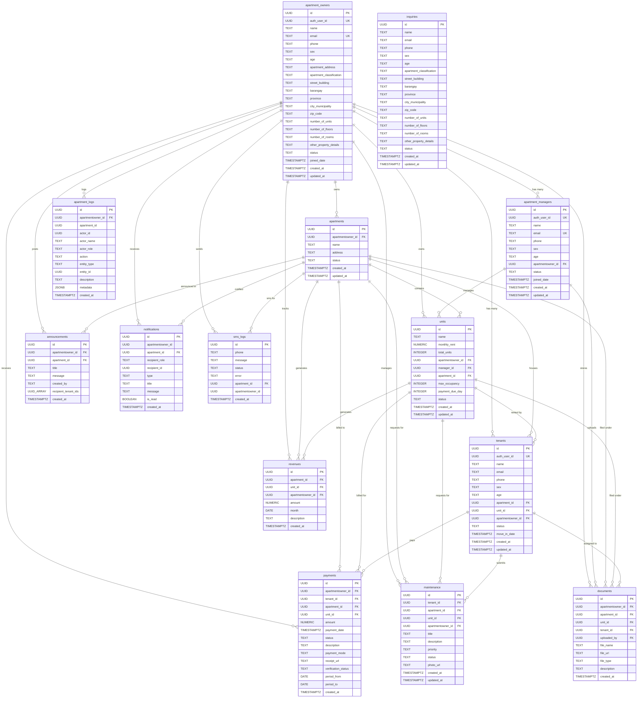

# PrimeLiving — Entity Relationship Diagram (ERD)

> Comprehensive database schema documentation for the PrimeLiving Apartment Management System.

---

## Database Overview

| Total Tables | Database | Managed By |
|:---:|:---:|:---:|
| **14** | PostgreSQL | Supabase |

---

## Entities (Tables)

### 1. `apartment_owners`

The central entity — represents apartment building owners/clients who register in the system.

| Column | Data Type | Constraints |
|--------|-----------|-------------|
| **id** | UUID | PK, DEFAULT gen_random_uuid() |
| auth_user_id | UUID | UNIQUE |
| name | TEXT | NOT NULL |
| email | TEXT | UNIQUE, NOT NULL |
| phone | TEXT | — |
| sex | TEXT | — |
| age | TEXT | — |
| apartment_address | TEXT | — |
| apartment_classification | TEXT | — |
| street_building | TEXT | — |
| barangay | TEXT | — |
| province | TEXT | — |
| city_municipality | TEXT | — |
| zip_code | TEXT | — |
| number_of_units | TEXT | — |
| number_of_floors | TEXT | — |
| number_of_rooms | TEXT | — |
| other_property_details | TEXT | — |
| status | TEXT | DEFAULT 'active', CHECK ('active', 'inactive') |
| joined_date | TIMESTAMPTZ | DEFAULT NOW() |
| created_at | TIMESTAMPTZ | DEFAULT NOW() |
| updated_at | TIMESTAMPTZ | DEFAULT NOW() |

---

### 2. `apartment_managers`

Managers assigned to work under an apartment owner.

| Column | Data Type | Constraints |
|--------|-----------|-------------|
| **id** | UUID | PK, DEFAULT gen_random_uuid() |
| auth_user_id | UUID | UNIQUE |
| name | TEXT | NOT NULL |
| email | TEXT | UNIQUE, NOT NULL |
| phone | TEXT | — |
| sex | TEXT | — |
| age | TEXT | — |
| apartmentowner_id | UUID | FK → apartment_owners(id) ON DELETE SET NULL |
| status | TEXT | DEFAULT 'active', CHECK ('active', 'inactive', 'pending') |
| joined_date | TIMESTAMPTZ | DEFAULT NOW() |
| created_at | TIMESTAMPTZ | DEFAULT NOW() |
| updated_at | TIMESTAMPTZ | DEFAULT NOW() |

---

### 3. `apartments`

Represents an apartment building/property owned by an apartment owner.

| Column | Data Type | Constraints |
|--------|-----------|-------------|
| **id** | UUID | PK, DEFAULT gen_random_uuid() |
| apartmentowner_id | UUID | FK → apartment_owners(id) ON DELETE SET NULL |
| name | TEXT | NOT NULL |
| address | TEXT | — |
| status | TEXT | NOT NULL, DEFAULT 'active', CHECK ('active', 'inactive') |
| created_at | TIMESTAMPTZ | NOT NULL, DEFAULT NOW() |
| updated_at | TIMESTAMPTZ | NOT NULL, DEFAULT NOW() |

**Indexes:** `idx_apartments_client_id`

---

### 4. `units`

Individual rental units within an apartment building.

| Column | Data Type | Constraints |
|--------|-----------|-------------|
| **id** | UUID | PK, DEFAULT gen_random_uuid() |
| name | TEXT | NOT NULL |
| monthly_rent | NUMERIC(10,2) | DEFAULT 0 |
| total_units | INTEGER | DEFAULT 0 |
| apartmentowner_id | UUID | FK → apartment_owners(id) ON DELETE SET NULL |
| manager_id | UUID | FK → apartment_managers(id) ON DELETE SET NULL |
| apartment_id | UUID | FK → apartments(id) ON DELETE SET NULL |
| max_occupancy | INTEGER | DEFAULT NULL |
| payment_due_day | INTEGER | DEFAULT NULL, CHECK (1–31) |
| status | TEXT | DEFAULT 'active', CHECK ('active', 'inactive') |
| created_at | TIMESTAMPTZ | DEFAULT NOW() |
| updated_at | TIMESTAMPTZ | DEFAULT NOW() |

**Indexes:** `idx_units_apartment_id`

> **Note:** The original `apartments` table was renamed to `units` via migration. A legacy compatibility view `apartments` (pointing to `units`) may still exist for backward compatibility. A new `apartments` table was created at the building/property level.

---

### 5. `tenants`

Tenants who rent a unit within an apartment.

| Column | Data Type | Constraints |
|--------|-----------|-------------|
| **id** | UUID | PK, DEFAULT gen_random_uuid() |
| auth_user_id | UUID | UNIQUE |
| name | TEXT | NOT NULL |
| email | TEXT | — |
| phone | TEXT | — |
| sex | TEXT | — |
| age | TEXT | — |
| apartment_id | UUID | FK → apartments(id) ON DELETE SET NULL |
| unit_id | UUID | FK → units(id) ON DELETE SET NULL |
| apartmentowner_id | UUID | FK → apartment_owners(id) ON DELETE SET NULL |
| status | TEXT | DEFAULT 'active', CHECK ('active', 'inactive', 'pending') |
| move_in_date | TIMESTAMPTZ | DEFAULT NOW() |
| created_at | TIMESTAMPTZ | DEFAULT NOW() |
| updated_at | TIMESTAMPTZ | DEFAULT NOW() |

**Indexes:** `idx_tenants_unit_id`
**Triggers:** `trg_sync_unit_apartment_ids_tenants` — keeps `unit_id` and `apartment_id` in sync

---

### 6. `payments`

Tracks monthly billing and payment records for tenants.

| Column | Data Type | Constraints |
|--------|-----------|-------------|
| **id** | UUID | PK, DEFAULT gen_random_uuid() |
| apartmentowner_id | UUID | FK → apartment_owners(id) ON DELETE SET NULL |
| tenant_id | UUID | FK → tenants(id) ON DELETE SET NULL |
| apartment_id | UUID | FK → apartments(id) ON DELETE SET NULL |
| unit_id | UUID | FK → units(id) ON DELETE SET NULL |
| amount | NUMERIC(10,2) | NOT NULL, DEFAULT 0 |
| payment_date | TIMESTAMPTZ | DEFAULT NOW() |
| status | TEXT | DEFAULT 'pending', CHECK ('paid', 'pending', 'overdue') |
| description | TEXT | — |
| payment_mode | TEXT | DEFAULT 'cash', CHECK ('gcash', 'maya', 'cash', 'bank_transfer') |
| receipt_url | TEXT | — |
| verification_status | TEXT | DEFAULT NULL, CHECK ('pending_verification', 'verified', 'approved', 'rejected') |
| period_from | DATE | — |
| period_to | DATE | — |
| created_at | TIMESTAMPTZ | DEFAULT NOW() |

**Indexes:** `idx_payments_unit_id`
**Triggers:** `trg_sync_unit_apartment_ids_payments` — keeps `unit_id` and `apartment_id` in sync

---

### 7. `maintenance`

Maintenance/repair requests submitted by tenants.

| Column | Data Type | Constraints |
|--------|-----------|-------------|
| **id** | UUID | PK, DEFAULT gen_random_uuid() |
| tenant_id | UUID | FK → tenants(id) ON DELETE SET NULL |
| apartment_id | UUID | FK → apartments(id) ON DELETE SET NULL |
| unit_id | UUID | FK → units(id) ON DELETE SET NULL |
| apartmentowner_id | UUID | FK → apartment_owners(id) ON DELETE SET NULL |
| title | TEXT | NOT NULL |
| description | TEXT | NOT NULL |
| priority | TEXT | DEFAULT 'medium', CHECK ('low', 'medium', 'high', 'urgent') |
| status | TEXT | DEFAULT 'pending', CHECK ('pending', 'in_progress', 'resolved', 'closed') |
| photo_url | TEXT | — |
| created_at | TIMESTAMPTZ | DEFAULT NOW() |
| updated_at | TIMESTAMPTZ | DEFAULT NOW() |

**Indexes:** `idx_maintenance_unit_id`
**Triggers:** `trg_sync_unit_apartment_ids_maintenance` — keeps `unit_id` and `apartment_id` in sync
**Legacy View:** `maintenance_requests` → compatibility view mapped to `maintenance`

---5

### 8. `announcements`

Notices posted by owners/managers, delivered to tenants.

| Column | Data Type | Constraints |
|--------|-----------|-------------|
| **id** | UUID | PK, DEFAULT gen_random_uuid() |
| apartmentowner_id | UUID | FK → apartment_owners(id) ON DELETE CASCADE |
| apartment_id | UUID | FK → apartments(id) ON DELETE SET NULL |
| title | TEXT | NOT NULL |
| message | TEXT | NOT NULL |
| created_by | TEXT | — |
| recipient_tenant_ids | UUID[] | NULL |
| created_at | TIMESTAMPTZ | NOT NULL, DEFAULT NOW() |

**Indexes:** `idx_announcements_apartment_id`

---

### 9. `documents`

Contract, lease, and other files uploaded by managers for tenants.

| Column | Data Type | Constraints |
|--------|-----------|-------------|
| **id** | UUID | PK, DEFAULT gen_random_uuid() |
| apartmentowner_id | UUID | FK → apartment_owners(id) ON DELETE SET NULL |
| apartment_id | UUID | FK → apartments(id) ON DELETE SET NULL |
| unit_id | UUID | FK → units(id) ON DELETE SET NULL |
| tenant_id | UUID | FK → tenants(id) ON DELETE SET NULL |
| uploaded_by | UUID | FK → apartment_managers(id) ON DELETE SET NULL |
| file_name | TEXT | NOT NULL |
| file_url | TEXT | NOT NULL |
| file_type | TEXT | DEFAULT 'application/pdf' |
| description | TEXT | — |
| created_at | TIMESTAMPTZ | NOT NULL, DEFAULT NOW() |

**Indexes:** `idx_documents_unit_id`
**Triggers:** `trg_sync_unit_apartment_ids_documents` — keeps `unit_id` and `apartment_id` in sync

---

### 10. `revenues`

Monthly revenue tracking per apartment/unit.

| Column | Data Type | Constraints |
|--------|-----------|-------------|
| **id** | UUID | PK, DEFAULT gen_random_uuid() |
| apartment_id | UUID | FK → apartments(id) ON DELETE SET NULL |
| unit_id | UUID | FK → units(id) ON DELETE SET NULL |
| apartmentowner_id | UUID | FK → apartment_owners(id) ON DELETE SET NULL |
| amount | NUMERIC(10,2) | NOT NULL, DEFAULT 0 |
| month | DATE | NOT NULL |
| description | TEXT | — |
| created_at | TIMESTAMPTZ | DEFAULT NOW() |

**Indexes:** `idx_revenues_unit_id`
**Triggers:** `trg_sync_unit_apartment_ids_revenues` — keeps `unit_id` and `apartment_id` in sync

---

### 11. `inquiries`

Landing page inquiries from potential apartment owners.

| Column | Data Type | Constraints |
|--------|-----------|-------------|
| **id** | UUID | PK, DEFAULT gen_random_uuid() |
| name | TEXT | NOT NULL |
| email | TEXT | NOT NULL |
| phone | TEXT | — |
| sex | TEXT | — |
| age | TEXT | — |
| apartment_classification | TEXT | — |
| street_building | TEXT | — |
| barangay | TEXT | — |
| province | TEXT | — |
| city_municipality | TEXT | — |
| zip_code | TEXT | — |
| number_of_units | TEXT | — |
| number_of_floors | TEXT | — |
| number_of_rooms | TEXT | — |
| other_property_details | TEXT | — |
| status | TEXT | DEFAULT 'pending', CHECK ('pending', 'responded', 'approved', 'cancelled', 'closed') |
| created_at | TIMESTAMPTZ | DEFAULT NOW() |
| updated_at | TIMESTAMPTZ | DEFAULT NOW() |

---

### 12. `apartment_logs`

Audit/activity log for all actions within an apartment owner's scope.

| Column | Data Type | Constraints |
|--------|-----------|-------------|
| **id** | UUID | PK, DEFAULT gen_random_uuid() |
| apartmentowner_id | UUID | FK → apartment_owners(id) ON DELETE CASCADE |
| apartment_id | UUID | — |
| actor_id | UUID | — |
| actor_name | TEXT | NOT NULL |
| actor_role | TEXT | CHECK ('owner', 'manager', 'tenant', 'system') |
| action | TEXT | NOT NULL |
| entity_type | TEXT | — |
| entity_id | UUID | — |
| description | TEXT | NOT NULL |
| metadata | JSONB | DEFAULT '{}' |
| created_at | TIMESTAMPTZ | DEFAULT NOW() |

**Indexes:** `idx_apartment_logs_apartmentowner_id`, `idx_apartment_logs_created_at (DESC)`

---

### 13. `notifications`

In-app notification records delivered to managers and tenants.

| Column | Data Type | Constraints |
|--------|-----------|-------------|
| **id** | UUID | PK |
| apartmentowner_id | UUID | — |
| apartment_id | UUID | FK → apartments(id) ON DELETE SET NULL |
| recipient_role | TEXT | e.g. 'manager', 'tenant' |
| recipient_id | UUID | — |
| type | TEXT | — |
| title | TEXT | — |
| message | TEXT | — |
| is_read | BOOLEAN | — |
| created_at | TIMESTAMPTZ | — |

**Indexes:** `idx_notifications_apartment_id`

> **Note:** Created directly in Supabase — no CREATE TABLE SQL in the codebase.

---

### 14. `sms_logs`

Logs of all SMS messages sent via Semaphore API.

| Column | Data Type | Constraints |
|--------|-----------|-------------|
| **id** | UUID | PK |
| phone | TEXT | — |
| message | TEXT | — |
| status | TEXT | 'sent' or 'failed' |
| error | TEXT | nullable |
| apartment_id | UUID | FK → apartments(id) ON DELETE SET NULL |
| apartmentowner_id | UUID | — |
| created_at | TIMESTAMPTZ | — |

**Indexes:** `idx_sms_logs_apartment_id`

> **Note:** Created directly in Supabase — no CREATE TABLE SQL in the codebase.

---

## Entity Relationships

### Relationship Summary Table

| Relationship | Type | Foreign Key |
|-------------|:----:|-------------|
| apartment_owners → apartment_managers | 1 : N | `apartment_managers.apartmentowner_id` |
| apartment_owners → apartments | 1 : N | `apartments.apartmentowner_id` |
| apartment_owners → units | 1 : N | `units.apartmentowner_id` |
| apartment_owners → tenants | 1 : N | `tenants.apartmentowner_id` |
| apartment_owners → payments | 1 : N | `payments.apartmentowner_id` |
| apartment_owners → maintenance | 1 : N | `maintenance.apartmentowner_id` |
| apartment_owners → announcements | 1 : N | `announcements.apartmentowner_id` |
| apartment_owners → documents | 1 : N | `documents.apartmentowner_id` |
| apartment_owners → revenues | 1 : N | `revenues.apartmentowner_id` |
| apartment_owners → apartment_logs | 1 : N | `apartment_logs.apartmentowner_id` |
| apartment_owners → notifications | 1 : N | `notifications.apartmentowner_id` |
| apartment_owners → sms_logs | 1 : N | `sms_logs.apartmentowner_id` |
| apartment_managers → units | 1 : N | `units.manager_id` |
| apartment_managers → documents | 1 : N | `documents.uploaded_by` |
| apartments → units | 1 : N | `units.apartment_id` |
| apartments → tenants | 1 : N | `tenants.apartment_id` |
| apartments → payments | 1 : N | `payments.apartment_id` |
| apartments → maintenance | 1 : N | `maintenance.apartment_id` |
| apartments → announcements | 1 : N | `announcements.apartment_id` |
| apartments → documents | 1 : N | `documents.apartment_id` |
| apartments → revenues | 1 : N | `revenues.apartment_id` |
| apartments → notifications | 1 : N | `notifications.apartment_id` |
| apartments → sms_logs | 1 : N | `sms_logs.apartment_id` |
| units → tenants | 1 : N | `tenants.unit_id` |
| units → payments | 1 : N | `payments.unit_id` |
| units → maintenance | 1 : N | `maintenance.unit_id` |
| units → documents | 1 : N | `documents.unit_id` |
| units → revenues | 1 : N | `revenues.unit_id` |
| tenants → payments | 1 : N | `payments.tenant_id` |
| tenants → maintenance | 1 : N | `maintenance.tenant_id` |
| tenants → documents | 1 : N | `documents.tenant_id` |

---

## ERD Diagram (Mermaid)

---

## Cardinality Rules

| Rule | Description |
|------|-------------|
| One **apartment_owner** has many **apartment_managers** | An owner can assign multiple managers |
| One **apartment_owner** has many **apartments** | An owner can own multiple buildings |
| One **apartment** has many **units** | A building contains multiple rental units |
| One **unit** has many **tenants** (historically) | A unit can have different tenants over time |
| One **tenant** has many **payments** | Monthly billings generate payment records |
| One **tenant** has many **maintenance** requests | Tenants can submit multiple requests |
| One **tenant** has many **documents** | Contracts, leases per tenant |
| One **apartment_manager** manages many **units** | `units.manager_id` → manager |
| One **apartment_manager** uploads many **documents** | `documents.uploaded_by` → manager |
| One **apartment_owner** has many **apartment_logs** | All activity is logged per owner scope |
| One **apartment** has many **announcements** | Managers post announcements per building |
| One **apartment** has many **notifications** | System-generated notifications per building |
| One **apartment** has many **sms_logs** | SMS sent for a specific building |

---

## Database Triggers

| Trigger | Table | Description |
|---------|-------|-------------|
| `trg_sync_unit_apartment_ids_tenants` | tenants | Syncs `unit_id` ↔ `apartment_id` on INSERT/UPDATE |
| `trg_sync_unit_apartment_ids_payments` | payments | Syncs `unit_id` ↔ `apartment_id` on INSERT/UPDATE |
| `trg_sync_unit_apartment_ids_documents` | documents | Syncs `unit_id` ↔ `apartment_id` on INSERT/UPDATE |
| `trg_sync_unit_apartment_ids_maintenance` | maintenance | Syncs `unit_id` ↔ `apartment_id` on INSERT/UPDATE |
| `trg_sync_unit_apartment_ids_revenues` | revenues | Syncs `unit_id` ↔ `apartment_id` on INSERT/UPDATE |

All triggers call `sync_unit_and_apartment_ids()` — ensures canonical `unit_id` and legacy `apartment_id` stay consistent.

---

## Security

- **Row Level Security (RLS)** is enabled on all tables.
- All tables have policies allowing full access for authenticated users.
- Authentication is handled by **Supabase Auth** (JWT-based).
- `auth_user_id` column in `apartment_owners`, `apartment_managers`, and `tenants` links to **Supabase Auth users**.

---

## Notes

- The original `apartments` table was renamed to `units` via migration. A new `apartments` table was created to represent the building/property level.
- Legacy compatibility views (`apartments` → `units`, `maintenance_requests` → `maintenance`) may still exist.
- `tenants.unit_id` and `tenants.apartment_id` are kept in sync via a database trigger (`sync_unit_and_apartment_ids()`).
- `notifications` and `sms_logs` tables were created directly in Supabase (no CREATE TABLE SQL in the codebase).
- All UUIDs use `gen_random_uuid()` for automatic generation.
- Timestamps use `TIMESTAMPTZ` with `DEFAULT NOW()`.
